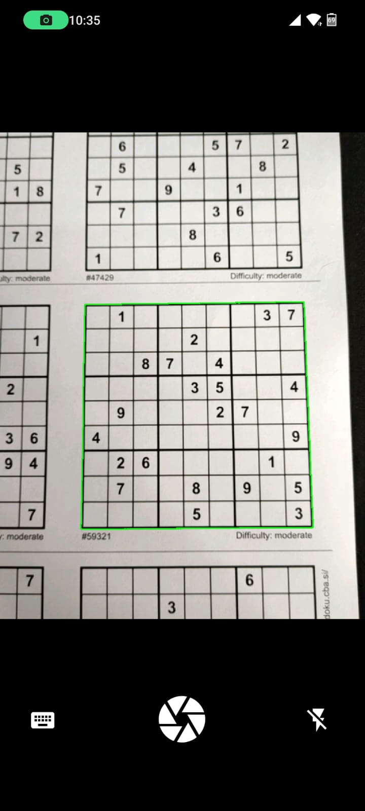
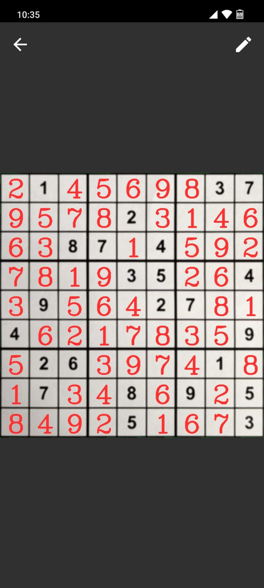

</img>

## Table of Contents
- [Introduction](#introduction)
- [How to use](#how-to-use)
- [How it works](#how-it-works)
- [Build](#build)
- [Libraries used](#libraries-used)

## Introduction

This project is an android app that solves sudoku, hence the name, recognized from images using Optical Character Recognition or entered manually.

I've built this project the first time in early 2022 ( [v1](https://github.com/hypertensiune/Android-Sudoku-Solver-OCR/tree/v1) branch ) and this is a refresh, an update to the original project.

## How to use

Download or [build](#build) the app yourself.
Use it like a camera app, press the shutter button when the sudoku it's detected and it will be solved. You can also edit it or input it manually if you want.

It works on both puzzles on paper or on screen, the only requirement is there is enough light and that it's smooth.

<p align="center">
  </img>
  &nbsp;&nbsp&nbsp;&nbsp&nbsp;
  </img>
</p>

## How it works

### Sudoku board detection

To identify the sudoku board the input image is processed as follows with [OpenCV](https://github.com/opencv/opencv):
- Using the Canny algorithm to detect all contours in the image.
- The biggest contour corresponds to the whole sudoku puzzle.
- Use the found contour to extract and warp the sudoku grid .

The numbers are detected using [MLKit Text Recognition](https://developers.google.com/ml-kit/vision/text-recognition/v2).

<p align="center">
  </img>
</p>

<br>

### Solving
For solving the puzzle I'm using a fairly simple, brute-force algorithm that relies on backtracking to generate the valid solution. 

It goes through the whole 2D array and for each number that needs to be found it tries all possibilities and continues with the following numbers. 


For each cell there are 9 possible numbers which means the time complexity of this algorithm is O(9<sup>n</sup>).

```
private fun solve(index: Int = 0): Boolean {
    for (i in index until 81) {
        val r = i / 9
        val c = i % 9
        if (sudokuBoard[r][c].number == 0) {
            for (n in 1..9) {
                if (isValidSolution(r, c, n)) {
                    sudokuBoard[r][c].number = n
                    if (solve(i + 1)) {
                        return true
                    }
                    sudokuBoard[r][c].number = 0
                }
            }
            return false
        }
    }
    return true
}
```
<br>
<p align="center">
  </img>
</p>
<p align="center">
  <span>Solve algorithm demo</span>
</p>

## Build

- Download or clone the repository and open it in Android Studio.
- Download the android version of [OpenCV](https://opencv.org/releases/). I used the latest version, 4.8.0.
- Import the OpenCV module in Android Studio.
    * Click **File > New > Import Module**, select the **OpenCV-android-sdk/sdk** directory and change the module name to **opencv**.
    * Goto **File > Project Structure > Dependencies** and on the **app** module add **opencv** as a dependency.
    * In **opencv build.gradle** add  ```android { namespace 'org.opencv' }```, change ```compileSdkVersion``` and ```targetSdkVersion``` to 33 and finally, add
      ```
      kotlinOptions {
        jvmTarget = '1.8'
      }
      buildFeatures {
        buildConfig true
        aidl true
      }
      ```
    * Further we need to modify the following classes in the OpenCV module:
        * **CameraBridgeViewBase**: add ```canvas.rotate(90f, canvas.getWidth() / 2, canvas.getHeight() / 2);``` in function ```deliverAndDrawFrame```, right before drawing the bitmap.
        * **JavaCameraView** add:
            ```
            public void turnOnFlashlight(){
                Camera.Parameters params = mCamera.getParameters();
                params.setFlashMode(Camera.Parameters.FLASH_MODE_TORCH);
                mCamera.setParameters(params);
            }
                
            public void turnOffFlashLight(){
                Camera.Parameters params = mCamera.getParameters();
                params.setFlashMode(Camera.Parameters.FLASH_MODE_OFF);
                mCamera.setParameters(params);
            }
            ```
            In function ```iniliazeCamera``` change
            ```
            if ((getLayoutParams().width == LayoutParams.MATCH_PARENT) && (getLayoutParams().height == LayoutParams.MATCH_PARENT))
                mScale = Math.min(((float)height)/mFrameHeight, ((float)width)/mFrameWidth);
            else
                mScale = 0;
            ```
            to
            ```
            mScale = Math.max(((float)height)/mFrameHeight, ((float)width)/mFrameWidth);
            ```
- Done, you can now build the project

## Libraries used
- [OpenCV](https://github.com/opencv/opencv) for image processing.
- [ML Kit Text Recognition V2](https://developers.google.com/ml-kit/vision/text-recognition/v2) for getting the numbers out of the image.
